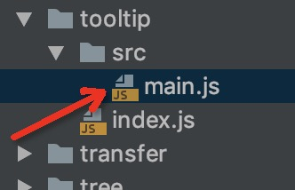
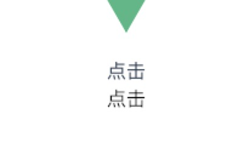

### Element的组件拆解之Tooltip

element ui的中的 toolpic组件 在 **packages/tooltip**目录下。


这个组件核心部分是 


toolpic 分别涉略了。

《**main.js vue-popper.js popup.js vdom.js dom.js**》等js文件

核心用到到js差不多就是main.js，vue-popper.js

其他都是element封装好都调用都公共方法

**vdom.js**

是找到this.$slots.default中都vode

因为this.$slots.default默认返回都是一个数组

**dom.js**

是添加样式，检测是否有这个样式，获取样式等一些方法，
对ie上对兼容等
有兴趣可以看看

main.js：代码
```js
//main.js
import Popper from 'element-ui/src/utils/vue-popper';
export default {
    mixins: [Popper],
    render (h) {
        // 初始化beforeCreate中vue的html
        this.newVue.node = (
            <div
                ref="popper"
                onMouseenter={() => {
                    this.show()
                }}
                onMouseLeave={() => {
                    this.hide()
                }}
                v-show={this.showPopper}
            >
                {this.$slots.default}
            </div>
        )   
       // 抛出自定义内容做固定展示在html上
        return this.$slots.default[0]
    },
    beforeCreate () {
        // 创建一个新的Vue对象
        this.newVue = new Vue({
            data: {node: ''},
            render(h){
                return this.node
            },
        }).$mount()
    },
    mounted(){
        this.referenceElm = this.$el;
        this.referenceElm.addEventListener('mouseenter',()=>{this.show()})
        this.referenceElm.addEventListener('mouseleave',()=>{this.hide()})
    },
    methods: {
        show(){
            console.log('经过啦')
            this.showPopper = true
        },
        hide() {
            console.log('离开啦')
            this.showPopper = false
        }
    }
}

```
main.js进行了简化

在生命周期beforeCreate中创建一个新对vue对象，

通过render函数初始化HTML 然后 return 一个 对象

例如：
```html
 <el-tooltip class="item" effect="dark" content="Top Left 提示文字" placement="top-start">
  <el-button>上左</el-button>
 </el-tooltip>
```
render中return的就是<el-button>上左</el-button>这快内容


vue-popper.js代码：
在这个文件的代码核心部分,elementUI也是用npm库里面的popper.js去完成
官方api再此

我这边已经黏贴了飞机票


简化后的vue-popper.js。
```js
import popperJs from 'popper.js';
export default {
    data() {
        return {
            showPopper: false
        }
    },
    watch: {
        showPopper(val) {
            val ? this.createpopper() : this.destroyPopper();
        }
    },
    methods: {
        createpopper(){
            document.body.appendChild(this.$refs.popper);
            new popperJs(this.referenceElm,this.$refs.popper)
        }
    }
}
```
这是最简单调用方式实现了一个toolpic


鼠标经过和离开会展示这个toolpic



总结

 1.通过main.js中生成HTML并在mounted生命周期中添加各种鼠标事件，改变showPopper的值
 
 2.同时把当前对this.$el赋值给this.referenceElm
 
 3.在vue-popper.js对showPopper的值进行监听，一旦showPopper的值为true时执行this.createpopper()，反之则摧毁
 
 4.在this.createpopper()函数中把 this.$refs.popper和 this.referenceElm传过去就好了
 

